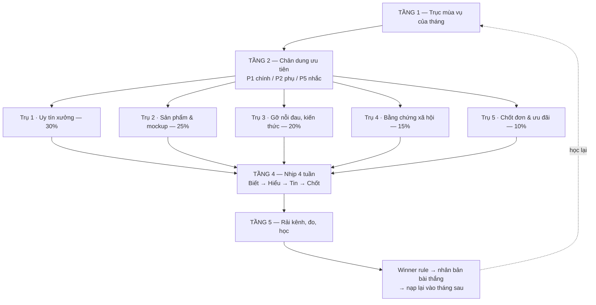

# SƠ ĐỒ KHUNG CONTENT THEO THÁNG — Quà tặng doanh nghiệp in logo

> Đây là **bộ khung lặp lại**. Mỗi tháng chỉ thay "trục mùa vụ" (xem file
> `03-lich-12-thang.md`), toàn bộ phần còn lại giữ nguyên. Nhờ vậy content sản
> xuất được hàng loạt mà không loạn thông điệp.

---

## 1. Sơ đồ tổng — 5 tầng

```
                    ┌─────────────────────────────────────────────┐
   TẦNG 1           │   TRỤC MÙA VỤ CỦA THÁNG (1 chủ đề duy nhất) │
   Chủ đề tháng     │   VD: T10 = "Chốt kế hoạch quà Tết"         │
                    └───────────────────┬─────────────────────────┘
                                        │
                    ┌───────────────────▼─────────────────────────┐
   TẦNG 2           │   CHÂN DUNG ƯU TIÊN CỦA THÁNG               │
   Ai nghe          │   Chính: P1 · Phụ: P2 · Nhắc: P5            │
                    └───────────────────┬─────────────────────────┘
                                        │
        ┌───────────┬───────────┬───────┴───┬───────────┬───────────┐
   TẦNG 3           │           │           │           │           │
   5 trụ nội dung  P1          P2          P3          P4          P5
                 UY TÍN     SẢN PHẨM    GỠ NỖI ĐAU  BẰNG CHỨNG   CHỐT ĐƠN
                 XƯỞNG      MOCKUP      KIẾN THỨC   XÃ HỘI       ƯU ĐÃI
                  30%        25%          20%         15%          10%
                    │           │           │           │           │
        └───────────┴───────────┴───────┬───┴───────────┴───────────┘
                                        │
                    ┌───────────────────▼─────────────────────────┐
   TẦNG 4           │  NHỊP 4 TUẦN: BIẾT → HIỂU → TIN → CHỐT      │
   Khi nào nói      │  T1 Nhận biết · T2 Cân nhắc                 │
                    │  T3 Tin tưởng · T4 Chốt đơn                 │
                    └───────────────────┬─────────────────────────┘
                                        │
                    ┌───────────────────▼─────────────────────────┐
   TẦNG 5           │  RẢI KÊNH + ĐO + HỌC                        │
   Ở đâu, đo gì     │  TikTok · FB · Web/SEO · Zalo OA · YouTube  │
                    │  · Email · Shopee · Livestream              │
                    └─────────────────────────────────────────────┘
```

Sơ đồ dạng mermaid (để dán vào tài liệu/website):



---

## 2. TẦNG 3 — 5 trụ nội dung (chi tiết)

### Trụ 1 · UY TÍN XƯỞNG — 30%
**Mục tiêu:** chứng minh "xưởng trực tiếp", diệt nghi ngờ "có phải cò không".
**Chân dung trúng:** P3, P4, P5.
**Định dạng:** video hậu trường, ảnh chuyền sản xuất, timelapse.

Mẫu ý tưởng dùng lại được vô hạn:
- Máy đang in/thêu logo cận cảnh (âm thanh máy = bằng chứng)
- Quy trình 1 đơn hàng đi từ file logo → khuôn → in → QC → đóng gói → lên xe
- Kho hàng, số lượng lớn xếp pallet
- Khâu QC: loại sản phẩm lỗi ra sao
- Một ngày ở xưởng mùa cao điểm
- Đội ngũ đóng gói chạy đơn 1.000 sản phẩm

### Trụ 2 · SẢN PHẨM & MOCKUP — 25%
**Mục tiêu:** để khách hình dung logo của họ nằm trên sản phẩm.
**Chân dung trúng:** P1, P2.
**Định dạng:** trước–sau, unbox, xoay 360, so sánh chất liệu.

- Mockup: logo khách → dựng lên sản phẩm → thành phẩm thật (3 khung hình)
- Unbox set quà hoàn chỉnh
- So sánh cùng một logo in trên 4 chất liệu khác nhau
- "Logo nhiều màu nên in kỹ thuật nào?"
- Combo set quà theo mức ngân sách (mức giá cụ thể → `NEEDS_DATA`)

### Trụ 3 · GỠ NỖI ĐAU & KIẾN THỨC — 20%
**Mục tiêu:** khách lưu bài, chia sẻ cho sếp; nuôi SEO và Zalo/Email.
**Chân dung trúng:** P1, P2.
**Định dạng:** checklist, video "3 lỗi", bài blog dài.

- Checklist đặt quà doanh nghiệp không bị trễ
- 3 lỗi khiến logo in ra lệch màu thương hiệu
- Cách tính ngược lịch: muốn nhận quà ngày X thì chốt mẫu ngày nào
- Cần chuẩn bị file logo dạng gì để in đẹp (AI/PDF vector)
- Hồ sơ cần có để kế toán duyệt thanh toán (VAT, hợp đồng, biên bản)
- Chọn quà theo ngân sách/người — khung phân tầng

### Trụ 4 · BẰNG CHỨNG XÃ HỘI — 15%
**Mục tiêu:** hạ rào cản tin tưởng ngay trước lúc chốt.
**Chân dung trúng:** cả 5, mạnh nhất với P3, P4.

- Case study: đơn số lượng lớn giao đúng hẹn (tên khách → `NEEDS_DATA` về quyền nêu tên)
- Ảnh chụp màn hình tin nhắn khách phản hồi (che thông tin cá nhân)
- Video khách nhận hàng / sự kiện dùng quà
- Đơn hàng gấp cứu kịp deadline
- Khách quay lại đặt lần 2, lần 3

### Trụ 5 · CHỐT ĐƠN & ƯU ĐÃI — 10%
**Mục tiêu:** thu lead nóng. Chỉ 10% nhưng đặt đúng chỗ (cuối tuần 4).
**CTA chuẩn:** xem mục 6.

- Deadline sản xuất mùa vụ ("đặt trước ngày ... mới kịp ...")
- Ưu đãi theo số lượng (mức ưu đãi → vùng đỏ, phải anh Bảo duyệt)
- Chính sách đại lý
- "Nhận đơn gấp" cho P4
- Nhắc suất sản xuất còn lại trong tháng

> **Luật vàng:** không bao giờ để 2 bài trụ 5 đứng cạnh nhau. Trước mỗi bài chốt
> phải có ít nhất 1 bài trụ 1 hoặc trụ 4 đứng ngay trước để "bảo lãnh niềm tin".

---

## 3. TẦNG 4 — Nhịp 4 tuần trong tháng

| Tuần | Vai trò | Trụ dùng nhiều | Mục tiêu đo |
|---|---|---|---|
| **Tuần 1 — NHẬN BIẾT** | Mở chủ đề mùa vụ, đánh vào nỗi đau. Kéo người lạ. | Trụ 3 + Trụ 1 | Reach, hold rate, view mới |
| **Tuần 2 — CÂN NHẮC** | Cho khách vật liệu để so sánh và trình sếp. | Trụ 2 + Trụ 3 | Lưu bài, share, click web |
| **Tuần 3 — TIN TƯỞNG** | Chứng minh làm được thật, đúng hẹn thật. | Trụ 1 + Trụ 4 | Comment hỏi giá, inbox |
| **Tuần 4 — CHỐT** | Đóng deadline, đẩy CTA mạnh. | Trụ 5 + Trụ 4 | Lead, số báo giá gửi đi |

Nhịp này lặp lại mỗi tháng. Tháng cao điểm (T9, T10, T11, T12, T1) thì **nén
lại thành 2 vòng/tháng** (tuần 1–2 là một vòng, tuần 3–4 là vòng thứ hai).

---

## 4. Lịch tuần mẫu — khung 7 ngày cố định

Đây là "khuôn đúc" để không phải nghĩ mỗi ngày đăng gì:

| Thứ | Kênh chính | Trụ | Định dạng |
|---|---|---|---|
| **Thứ 2** | TikTok + FB | Trụ 1 | Hậu trường xưởng đầu tuần, máy chạy đơn |
| **Thứ 3** | TikTok + FB | Trụ 2 | Mockup logo khách / trước–sau |
| **Thứ 4** | TikTok + Website | Trụ 3 | Kiến thức, checklist (bài web dài + cắt video) |
| **Thứ 5** | TikTok + FB | Trụ 4 | Case study / feedback khách |
| **Thứ 6** | TikTok + FB + Zalo OA | Trụ 2 | Sản phẩm theo mùa vụ tháng |
| **Thứ 7** | TikTok | Trụ 1 hoặc 3 | Nội dung nhẹ, đời thường ở xưởng, kể chuyện nghề |
| **Chủ nhật** | FB + Zalo | Trụ 5 (chỉ tuần 4) | Chốt đơn / ưu đãi / nhắc deadline |

**Định lượng tối thiểu mỗi tháng:**

| Kênh | Sản lượng/tháng | Ghi chú |
|---|---|---|
| TikTok | 20–26 video ngắn | Trục chính kéo nhận biết |
| Facebook Page | 20–26 post (đăng lại + biến thể) | Trục chính thu lead |
| Website/SEO | 4 bài chuẩn SEO | Nuôi từ khóa dài hạn |
| Zalo OA | 2 broadcast | Đúng khung giờ cho phép |
| YouTube | 1–2 video dài (3–8 phút) | Gộp từ nội dung xưởng đã quay |
| Email | 2 chiến dịch | Phân nhóm theo chân dung |
| Shopee | Cập nhật mẫu lẻ | Bắt khách mua thử số lượng nhỏ |
| Livestream | 1–2 buổi (tháng cao điểm) | Livestream ngay tại xưởng |

> Không cần quay 26 lần. Quay gom **2 buổi/tháng tại xưởng**, mỗi buổi ra
> 10–14 video. Bài web dài cắt ra được 3–4 video ngắn.

---

## 5. Ma trận: chân dung × trụ nội dung × kênh

| | P1 HR/Admin | P2 Marketing | P3 Chủ DN | P4 Agency | P5 Đại lý |
|---|---|---|---|---|---|
| **Trụ 1 Uy tín xưởng** | ○ | ○ | ● | ● | ● |
| **Trụ 2 Mockup** | ● | ● | ○ | ● | ● |
| **Trụ 3 Kiến thức** | ● | ● | ○ | ○ | ○ |
| **Trụ 4 Bằng chứng** | ● | ○ | ● | ● | ○ |
| **Trụ 5 Chốt đơn** | ● | ○ | ● | ● | ● |
| **Kênh mạnh nhất** | FB, Google | FB, TikTok | FB, Zalo | Zalo, gọi | TikTok, Zalo |

● = trúng đích chính · ○ = phụ trợ

---

## 6. Thư viện CTA theo mục tiêu (dùng đúng, không trộn)

| Tình huống | CTA |
|---|---|
| Lead nóng | «Nhắn **"BÁO GIÁ"** để nhận mẫu phù hợp ngành của bạn» |
| Muốn chốt demo | «Gửi logo, bên em lên demo trong hôm nay» |
| Đặt lịch tư vấn | «Để lại số/Zalo, bên em gọi tư vấn đúng nhu cầu» |
| Kéo đại lý (P5) | «Nhắn **"ĐẠI LÝ"** để nhận chính sách sỉ» |
| Đơn gấp (P4) | «Nhắn **"GẤP"** để được ưu tiên kiểm tra tiến độ» |

Mỗi bài chỉ dùng **một** CTA. Trụ 1, 3 dùng CTA mềm (demo, tư vấn); trụ 5 dùng
CTA cứng (báo giá, gấp).

---

## 7. Cấu trúc mỗi bài (bắt buộc theo)

```
HOOK      → nỗi đau cụ thể (trễ tiến độ / in xấu / giá mập mờ / thiếu VAT)
NỖI ĐAU   → 2–4 gạch đầu dòng, dùng đúng ngôn ngữ của chân dung
GIẢI PHÁP → xưởng trực tiếp · demo trước · báo giá rõ · tiến độ rõ
LỢI ÍCH   → đồng bộ thương hiệu · có VAT & hồ sơ · chủ động tiến độ
CTA       → chọn 1 dòng từ mục 6
```

Với video TikTok: **3 giây đầu phải là hook**, cảnh xưởng hoặc mockup lên hình
ngay, không intro, không chào hỏi.

---

## 8. TẦNG 5 — Đo & học (chạy mỗi tuần)

**A/B test 3 lớp, mỗi tuần chỉ đổi 1 lớp:**
1. **Hook** — nỗi đau vs lợi ích vs case study
2. **CTA** — báo giá vs demo vs bảng giá
3. **Creative** — mockup thật vs ảnh xưởng vs UGC

**Winner rule theo mục tiêu:**

| Mục tiêu | Chỉ số quyết định thắng |
|---|---|
| Thu lead | `lead_rate` |
| Phủ nhận biết | `hold_rate` / view-through |
| Kéo về landing | `form_conversion_rate` |
| YouTube | CTR + retention |

**Vòng học:** capture → evaluate → retrieve → revise → redeploy.
- **Hằng ngày:** nạp dữ liệu, xếp lại thứ tự ưu tiên
- **Hằng tuần:** chốt hook/CTA thắng → nhân bản ra 3–5 biến thể cho tuần sau
- **2 tuần:** chỉnh policy/dashboard
- **Hằng tháng:** rà lại tỷ lệ 5 trụ theo doanh thu thực tế từng chân dung

---

## 9. Ranh giới phê duyệt khi chạy content

- **Tự làm, không hỏi:** viết nháp, tạo biến thể tiêu đề/CTA/thumbnail, đăng
  theo lịch đã duyệt, trả lời FAQ theo knowledge base, gom comment thành ticket,
  lấy analytics, tạo báo cáo.
- **Làm rồi gửi digest:** sửa caption trước giờ đăng, đổi ưu đãi trong khung
  cho phép, tạo campaign draft.
- **BẮT BUỘC hỏi anh Bảo:** công bố giá/MOQ/chiết khấu mới, chiết khấu >10%,
  deal >50 triệu, ngân sách quảng cáo đổi >1 triệu/ngày/kênh, nội dung dính từ
  khóa rủi ro (khiếu nại, bồi thường, VAT, hợp đồng, công nợ, phạt), phát ngôn
  khủng hoảng.
